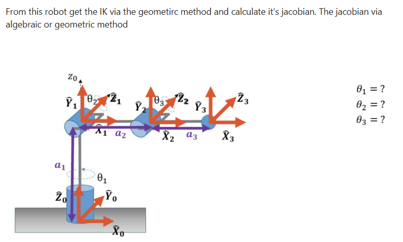
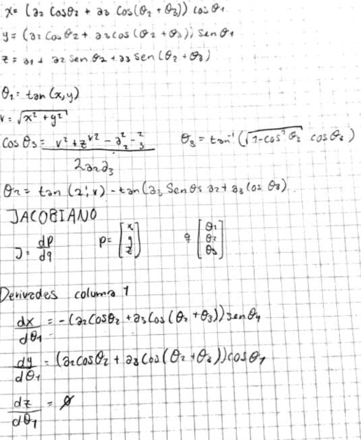
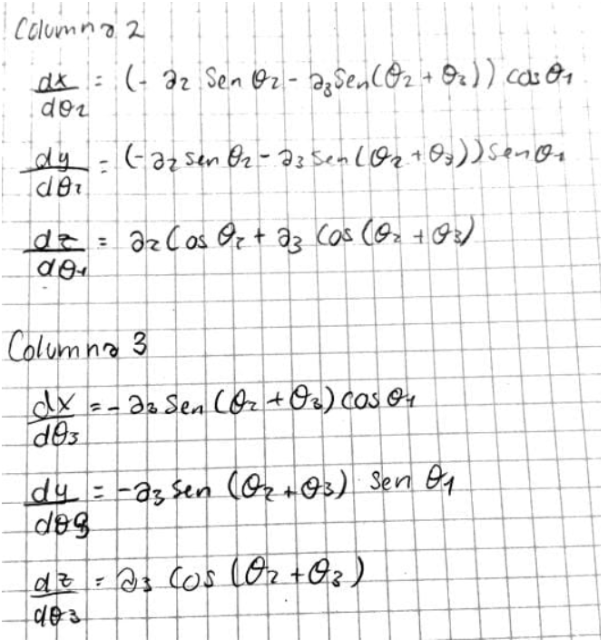

# IK and jacobian

In this activity we will do the IK by geometric method and the Jacobian by algebraic method

## Robot

## Procedure Geometric Method

## Jacobian

|  |  |  |  |
|-----------:|:--:|:--:|:--:|
| ∂x/∂θ | -(a₂cosθ₂ + a₃cos(θ₂+θ₃))sinθ₁ | (-a₂sinθ₂ - a₃sin(θ₂+θ₃))cosθ₁ | -a₃sin(θ₂+θ₃)cosθ₁ |
| ∂y/∂θ | (a₂cosθ₂ + a₃cos(θ₂+θ₃))cosθ₁ | (-a₂sinθ₂ - a₃sin(θ₂+θ₃))sinθ₁ | -a₃sin(θ₂+θ₃)sinθ₁ |
| ∂z/∂θ | 0 | a₂cosθ₂ + a₃cos(θ₂+θ₃) | a₃cos(θ₂+θ₃) |

