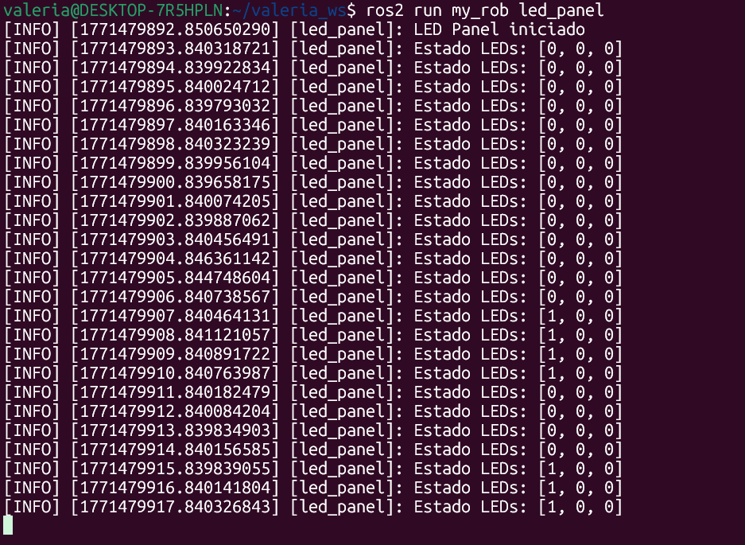
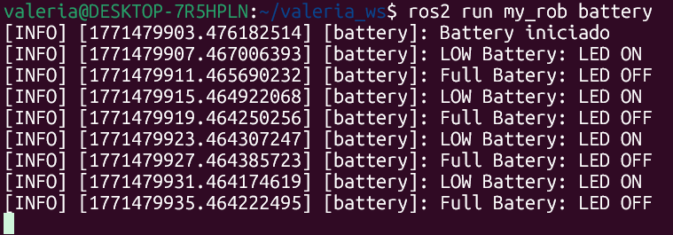
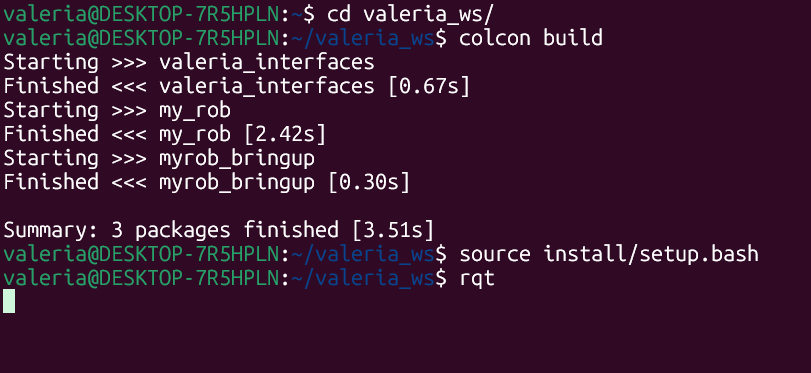
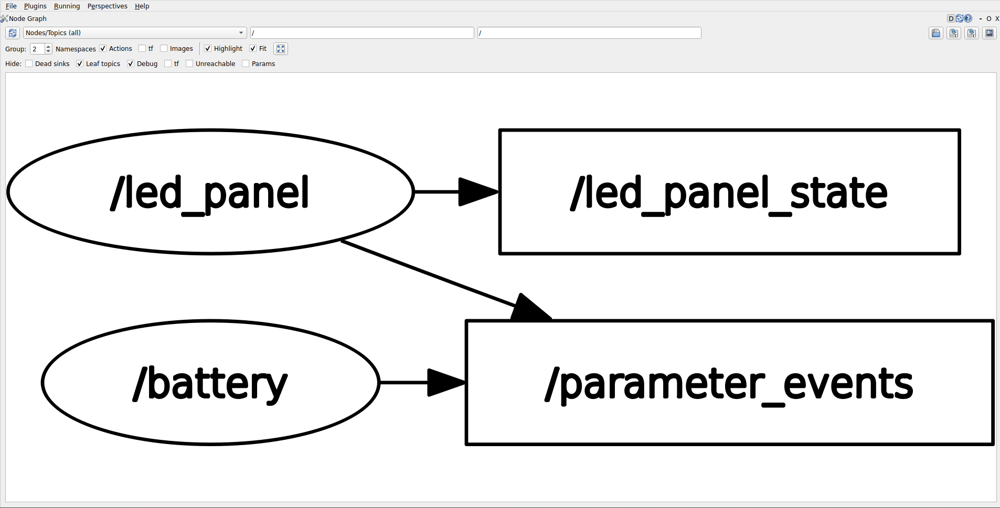

# Activiy ROS Custom Interfaces

In this activity, two ROS 2 nodes are created: a battery node and a LED panel node. The battery node simulates the evolution of a battery’s state over time, alternating between full and empty. When the battery becomes empty, it sends a service request to the LED panel asking to turn on a LED. After a few seconds, when the battery becomes full again, it sends another request to turn that LED off. This behavior repeats continuously, simulating a cyclic battery process.

## Custom interfaces

 LedPanelState.smg
``` codigo
int32[] leds

```
 SetLed.srv
``` codigo
int32 led_number
bool state
---
bool success
string message

```

## Codes

1. **Led panel**  

``` codigo

#!/usr/bin/env python3

import rclpy
from rclpy.node import Node
from valeria_interfaces.msg import LedPanelState
from valeria_interfaces.srv import SetLed


class LedPanel(Node):

    def __init__(self):
        super().__init__('led_panel')

        self.leds = [0, 0, 0]

        self.publisher_ = self.create_publisher(
            LedPanelState,
            'led_panel_state',
            10
        )

        # Servicio
        self.service = self.create_service(
            SetLed,
            'set_led',
            self.set_led_callback
        )

        self.timer = self.create_timer(1.0, self.publish_state)

        self.get_logger().info("LED Panel iniciado")

    def publish_state(self):
        msg = LedPanelState()
        msg.leds = self.leds
        self.publisher_.publish(msg)
        self.get_logger().info(f"Estado LEDs: {self.leds}")

    def set_led_callback(self, request, response):

        if request.led_number >= 0 and request.led_number < len(self.leds):

            if request.state:
                self.leds[request.led_number] = 1
            else:
                self.leds[request.led_number] = 0

            response.success = True
            response.message = "LED cambiado correctamente"

        else:
            response.success = False
            response.message = "LED inválido"

        return response


def main(args=None):
    rclpy.init(args=args)
    node = LedPanel()
    rclpy.spin(node)
    rclpy.shutdown()


```
2. **Battery**  

``` codigo

#!/usr/bin/env python3

import rclpy
from rclpy.node import Node
from valeria_interfaces.srv import SetLed


class Battery(Node):

    def __init__(self):
        super().__init__('battery')

        self.client = self.create_client(SetLed, 'set_led')

        while not self.client.wait_for_service(timeout_sec=1.0):
            self.get_logger().info("Esperando servicio set_led...")

        self.empty = False

        self.timer_empty = self.create_timer(4.0, self.make_empty)

        self.get_logger().info("Battery iniciado")

    def make_empty(self):

        request = SetLed.Request()
        request.led_number = 0

        if not self.empty:
            self.get_logger().info("LOW Battery: LED ON")
            request.state = True
            self.empty = True
        else:
            self.get_logger().info("Full Batery: LED OFF")
            request.state = False
            self.empty = False

        self.client.call_async(request)


def main(args=None):
    rclpy.init(args=args)
    node = Battery()
    rclpy.spin(node)
    rclpy.shutdown()


```
## Termial Results

Termial 1

``` codigo
ros2 run my_rob led_panel

``` 



Termial 2

``` codigo
ros2 run my_rob battery

``` 



Termial 3

``` codigo
rqt

``` 




