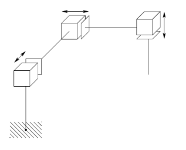
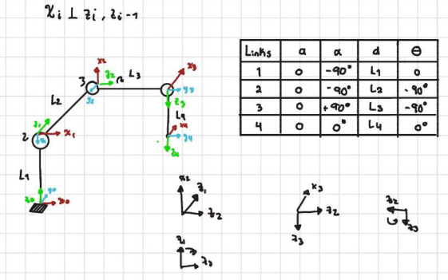
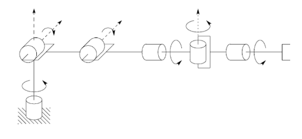
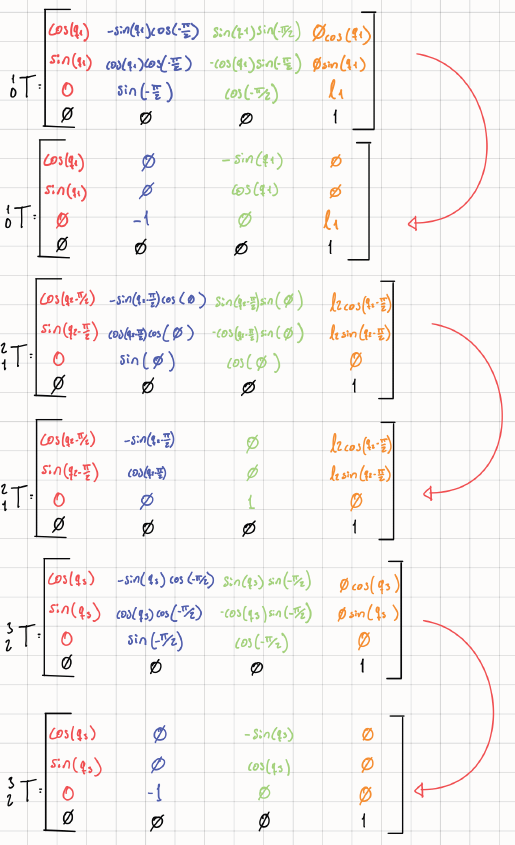
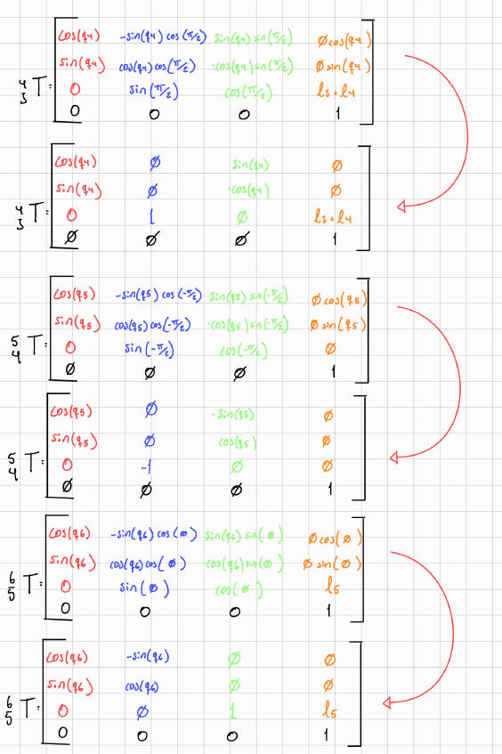
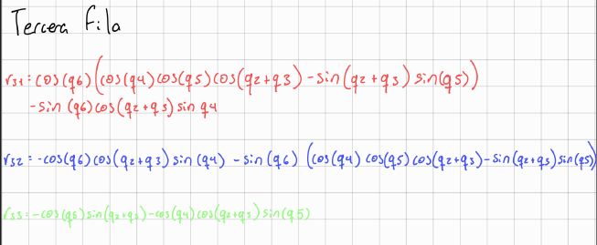
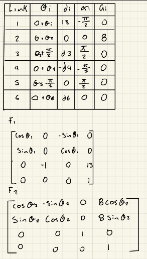
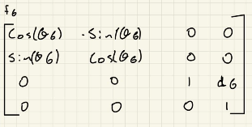

# Forward Kinematics
## Matrix  and DH placement
## Exercise 1


# Code 

```
import sympy as sp

# ===== VARIABLE SIMBÓLICA =====
L1 = sp.symbols('L1')
L2 = sp.symbols('L2')
L3 = sp.symbols('L3')

# ===== MATRIZ T1 =====
T1 = sp.Matrix([
    [1, 0,  0,  0],
    [0, 0,  1,  0],
    [0, -1, 0,  L1],
    [0, 0,  0,  1]
])

# ===== MATRIZ T2 =====
T2 = sp.Matrix([
    [0,  0, -1,  0],
    [1,  0,  0,  0],
    [0, -1,  0,  L2],
    [0,  0,  0,  1]
])

# ===== MATRIZ T3 =====
T3 = sp.Matrix([
    [1,  0,  0,  0],
    [0,  0, -1,  0],
    [0,  1,  0,  L3],
    [0,  0,  0,  1]
])
# ===== MULTIPLICACIÓN =====
T_total = T1 * T2 * T3
# ===== MOSTRAR =====
sp.pprint(T_total)

```
## Exercise 2






# Code:

```
import sympy as sp

# ===== VARIABLE SIMBÓLICA =====
l1 = sp.symbols('l1')
l2 = sp.symbols('l2')
l3 = sp.symbols('l3')
l4 = sp.symbols('l4')

# ===== MATRICES 4x4 =====
A = sp.Matrix([
    [1, 0, 0, 0],
    [0, 0, 1, 0],
    [0, -1, 0, l1],
    [0, 0, 0, 1]
])

B = sp.Matrix([
    [0, 0, 1, 0],
    [-1,  0, 0, 0],
    [0,  -1, 0, l2],
    [0,  0, 0, 1]
])

C = sp.Matrix([
    [0, 0, -1, 0],
    [-1,  0, 0, 0],
    [0,  1, 0, l3],
    [0,  0, 0, 1]
])

D = sp.Matrix([
    [1, 0, 0, 0],
    [0, 1, 0, 0],
    [0, 0, 1, l4],
    [0, 0, 0, 1]
])

# ===== MULTIPLICACIÓN =====
resultado = A * B * C * D

# ===== MOSTRAR =====
sp.pprint(resultado)

```

## Exercise 3




```

import sympy as sp

# Símbolos
L1, L2, L3, L4, L5 = sp.symbols('L1 L2 L3 L4 L5')

T1 = sp.Matrix([
    [1, 0, 0, 0],
    [0, sp.cos(-sp.pi/2), -sp.sin(-sp.pi/2), 0],
    [0, sp.sin(-sp.pi/2),  sp.cos(-sp.pi/2), L1],
    [0, 0, 0, 1]
])

T2 = sp.Matrix([
    [1, 0, 0, L2],
    [0, 1, 0, 0],
    [0, 0, 1, 0],
    [0, 0, 0, 1]
])

T3 = sp.Matrix([
    [1, 0, 0, 0],
    [0, sp.cos(sp.pi/2), -sp.sin(sp.pi/2), 0],
    [0, sp.sin(sp.pi/2),  sp.cos(sp.pi/2), 0],
    [0, 0, 0, 1]
])

T4 = sp.Matrix([
    [1, 0, 0, 0],
    [0, sp.cos(sp.pi/2), -sp.sin(sp.pi/2), 0],
    [0, sp.sin(sp.pi/2),  sp.cos(sp.pi/2), L3 + L4],
    [0, 0, 0, 1]
])

T5 = sp.Matrix([
    [1, 0, 0, 0],
    [0, sp.cos(sp.pi/2), -sp.sin(sp.pi/2), 0],
    [0, sp.sin(sp.pi/2),  sp.cos(sp.pi/2), 0],
    [0, 0, 0, 1]
])

T6 = sp.Matrix([
    [1, 0, 0, 0],
    [0, 1, 0, 0],
    [0, 0, 1, L5],
    [0, 0, 0, 1]
])

T = T1 * T2 * T3 * T4 * T5 * T6
T = sp.simplify(T)

sp.pprint(T)

```

## Exercise 4









## Exercise 5







# Code:

```
# Final Transformation Matrix

T06 = [
 r11 r12 r13 px
 r21 r22 r23 py
 r31 r32 r33 pz
 0   0   0   1
]

---

 #Rotation Terms

r11 = c1*c23*c4*s5 + c1*s23*c5 - s1*s4*s5

r12 = c6*(c1*c23*s4 + s1*c4)
      - s6*(c1*c23*c4*c5 - c1*s23*s5 - s1*s4*c5)

r13 = s6*(c1*c23*s4 + s1*c4)
      + c6*(c1*c23*c4*c5 - c1*s23*s5 - s1*s4*c5)

r21 = s1*c23*c4*s5 + s1*s23*c5 + c1*s4*s5

r22 = c6*(s1*c23*s4 - c1*c4)
      - s6*(s1*c23*c4*c5 - s1*s23*s5 + c1*s4*c5)

r23 = s6*(s1*c23*s4 - c1*c4)
      + c6*(s1*c23*c4*c5 - s1*s23*s5 + c1*s4*c5)

r31 = s23*c4*s5 - c23*c5

r32 = c6*s23*s4
      - s6*(s23*c4*c5 + c23*s5)

r33 = s6*s23*s4
      + c6*(s23*c4*c5 + c23*s5)

# Position Terms

px = c1*(8*c2 + 8*c23 - d4*s23) - d3*s1

py = s1*(8*c2 + 8*c23 - d4*s23) + d3*c1

pz = 13 + 8*s2 + 8*s23 + d4*c23 + d6
```

