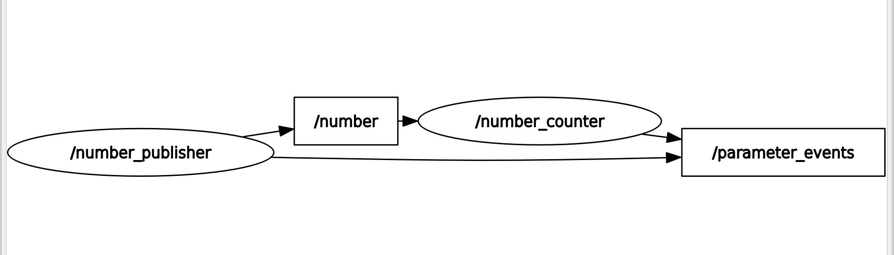

# Activity Ros 2 Services

Let’s practice with ROS 2 Services!
We will start from the Topic activity we did in the last section on Topics.
Here is what we got:


Quick recap:

• The node “number_publisher” publishes a number on the /”number” topic.

• The node “number_counter” gets the number, adds it to a counter, and publishes the counter on the “/number_count” topic.

And now, here is what we’ll add:


---



## Codes

1. **Subscriber and publisher code**  

``` codigo

#!/usr/bin/env python3
#!/usr/bin/env python3

import rclpy
from rclpy.node import Node
from example_interfaces.msg import Int64


class NumberCounter(Node):

    def __init__(self):
        super().__init__('number_counter')

        self.counter = 0

        self.subscription = self.create_subscription(
            Int64,
            '/number',
            self.listener_callback,
            10
        )

        self.publisher_ = self.create_publisher(
            Int64,
            '/number_count',
            10
        )

        self.get_logger().info('Number Counter iniciado')

    def listener_callback(self, msg):
        self.counter += msg.data

        out_msg = Int64()
        out_msg.data = self.counter
        self.publisher_.publish(out_msg)

        self.get_logger().info(
            f'Recibido: {msg.data} | Total acumulado: {self.counter}'
        )


def main(args=None):
    rclpy.init(args=args)
    node = NumberCounter()
    rclpy.spin(node)
    rclpy.shutdown()


if __name__ == '__main__':
    main()

```
2. **Publisher code**  

``` codigo

#!/usr/bin/env python3

import rclpy
from rclpy.node import Node
from example_interfaces.msg import Int64


class NumberPublisher(Node):

    def __init__(self):
        super().__init__('number_publisher')

        self.publisher_ = self.create_publisher(
            Int64,
            '/number',
            10
        )

        self.timer = self.create_timer(1.0, self.timer_callback)

        self.number = 2  
        self.get_logger().info('Number Publisher iniciado')

    def timer_callback(self):
        msg = Int64()
        msg.data = self.number
        self.publisher_.publish(msg)
        self.get_logger().info(f'Publicando: {msg.data}')


def main(args=None):
    rclpy.init(args=args)
    node = NumberPublisher()
    rclpy.spin(node)
    rclpy.shutdown()


if __name__ == '__main__':
    main()

```

2. **Setup py code**  

``` codigo

from setuptools import find_packages, setup

package_name = 'my_rob'

setup(
    name=package_name,
    version='0.0.0',
    packages=find_packages(exclude=['test']),
    data_files=[
        ('share/ament_index/resource_index/packages',
            ['resource/' + package_name]),
        ('share/' + package_name, ['package.xml']),
    ],
    install_requires=['setuptools'],
    zip_safe=True,
    maintainer='valeria',
    maintainer_email='valeria@todo.todo',
    description='TODO: Package description',
    license='TODO: License declaration',
    extras_require={
        'test': [
            'pytest',
        ],
    },
    entry_points={
        'console_scripts': [
            'r2d2 = my_rob.my_first_node:main',
            'number_publisher = myrob_pkg.number_publisher:main',
            'number_counter = my_rob.number_counter:main',
            'other_file = myrob_pkg.other_file:main',
            'number_publisher2 = my_rob.number_publisher2:main',
            'number_counter2 = my_rob.number_counter2:main',
        ],
    },
)

```