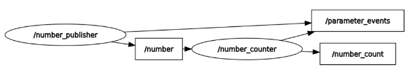
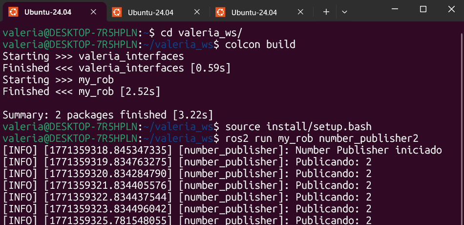
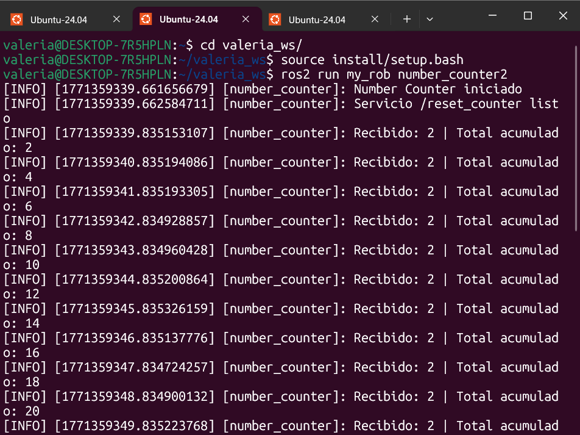
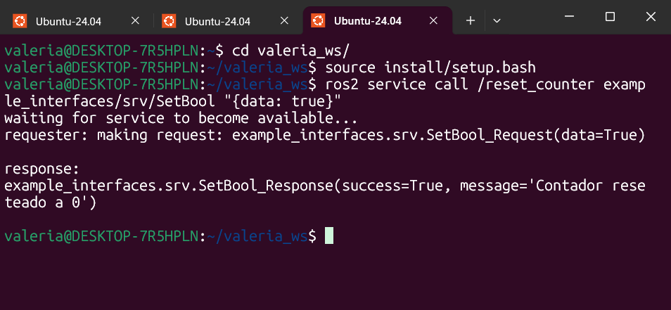
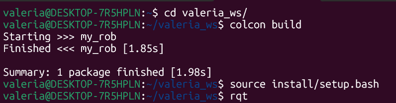

# Activity Ros 2 Services

Let’s practice with ROS 2 Services!
We will start from the Topic activity we did in the last section on Topics.
Here is what we got:


Quick recap:

• The node “number_publisher” publishes a number on the /”number” topic.

• The node “number_counter” gets the number, adds it to a counter, and publishes the counter on the “/number_count” topic.

And now, here is what we’ll add:


---



## Codes

1. **Publisher code**  

``` codigo

#!/usr/bin/env python3

import rclpy
from rclpy.node import Node
from example_interfaces.msg import Int64


class NumberPublisher(Node):

    def __init__(self):
        super().__init__('number_publisher')

        self.publisher_ = self.create_publisher(
            Int64,
            '/number',
            10
        )

        self.timer = self.create_timer(1.0, self.timer_callback)

        self.number = 2  
        self.get_logger().info('Number Publisher iniciado')

    def timer_callback(self):
        msg = Int64()
        msg.data = self.number
        self.publisher_.publish(msg)
        self.get_logger().info(f'Publicando: {msg.data}')


def main(args=None):
    rclpy.init(args=args)
    node = NumberPublisher()
    rclpy.spin(node)
    rclpy.shutdown()


if __name__ == '__main__':
    main()


```
2. **Couter code**  

``` codigo

#!/usr/bin/env python3

import rclpy
from rclpy.node import Node
from example_interfaces.msg import Int64
from example_interfaces.srv import SetBool


class NumberCounter(Node):

    def __init__(self):
        super().__init__('number_counter')

        self.counter = 0

        self.subscription = self.create_subscription(
            Int64,
            '/number',
            self.listener_callback,
            10
        )

        self.publisher_ = self.create_publisher(
            Int64,
            '/number_count',
            10
        )

        
        self.reset_service = self.create_service(
            SetBool,
            'reset_counter',   
            self.reset_counter_callback
        )

        self.get_logger().info('Number Counter iniciado')
        self.get_logger().info('Servicio /reset_counter listo')

    def listener_callback(self, msg):
        self.counter += msg.data

        out_msg = Int64()
        out_msg.data = self.counter
        self.publisher_.publish(out_msg)

        self.get_logger().info(
            f'Recibido: {msg.data} | Total acumulado: {self.counter}'
        )

    
    def reset_counter_callback(self, request, response):

        if request.data:
            self.counter = 0
            response.success = True
            response.message = "Contador reseteado a 0"
            self.get_logger().info("Contador reseteado a 0")
        else:
            response.success = False
            response.message = "No se reseteó (data fue False)"

        return response


def main(args=None):
    rclpy.init(args=args)
    node = NumberCounter()
    rclpy.spin(node)
    rclpy.shutdown()


if __name__ == '__main__':
    main()


```
## Termial Results









Now when we run this code in the terminal:



We get this graph:

