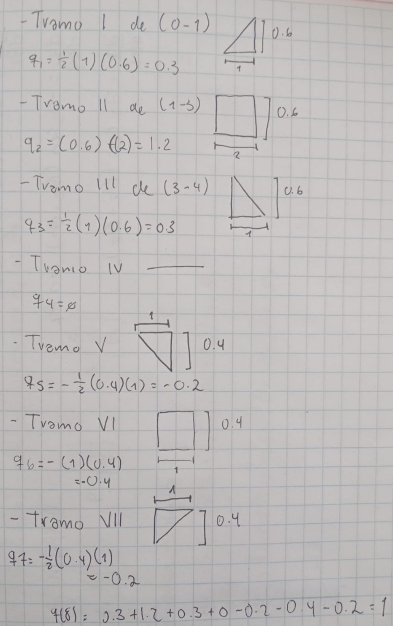
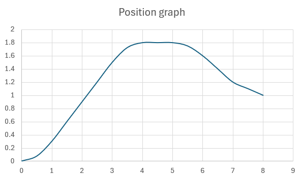

# Trajectory planning
## Exercise 1

Given a position graph, identify: where velocity is zero, where velocity is maximum, and where acceleration is positive or negative.

For this exercise, keep in mind that:

Speed 0 =  where the graph is horizontal

Maximum speed =  where the slope is steepest

Positive acceleration = when the slope increases 
(upward curve)

Negative acceleration = when the slope decreases (downward curve)

### Point analysis:

Zero velocity: A, E, G.

Maximum velocity: D

Positive acceleration: B, C.

negative acceleration: F

## Exercise 2

Given a trapezoidal velocity graph, compute total displacement from the area under the curve.

### Formula:
Δq = ½ (ta)(vmax)+(ta)(vmax) + ½ (ta)(vmax)

### Procedure:

Δq = ½ (0.5)(0.8) + (2)(0.8) + ½  (0.5)(0.8)

Δq = 2 rad

## Exercise 3

### Conditions:

Comparison of:

Δq & vmax²/amax 

If: Δq ≥ vmax²/amax (Trapezoidal)

If: Δq < vmax²/amax (Triangular)

### A) 

Δq=5

vmax=2

amax=4

vmax/amax= 2²/4 = 4/4 = 1

5>1 = TRAPEZOIDAL

### B)

Δq=0.4

vmax=2

amax=4

vmax/amax= 2²/4 = 4/4 = 1

0.4<1 = TRIANGULAR

## Exercise 4

Sketch the position graph corresponding to a given velocity graph.

## Exercise 5

### A)

Δq=2, vmax​=1, amax​=4

Δqmin = vmax² / amax = (1)² / 4 = 0.25 rad

2 > 0.25 → TRAPEZOIDAL

### B)

ta = vmax / amax = 1 / 4 = 0.25 s

tc = ((Δq − vmax) (ta)) / vmax = ((2 − 1) (0.25)) / 1 = 1.75 s

T= 2ta ​ + tc ​= 0.5 + 1.75 = 2.25s

### C)

Acceleration (0 ≤ t ≤ t_a): q̇(t) = (amax) (t) = 4t

Constant (ta ≤ t ≤ ta + tc): q̇(t) = vmax = 1 rad/s

Deceleration (ta + tc ≤ t ≤ T): q̇(t) = (vmax − amax) (t − (ta + tc)) = 1 − 4·(t − 2.0)

### D)
Acceleration (0 ≤ t ≤ 0.25): 

q(t) = (½) (amax) (t²) = 2t²

Constant (0.25 ≤ t ≤ 2.0): 

q(t) = q(ta) + vmax·(t − ta) = (0.03125 + 1) (t − 0.25)

Deceleration (2.0 ≤ t ≤ 2.25): 

q(t) = q(t_a + t_c) + v_max·(t−2.0) − ½·a_max·(t−2.0)² = 1.78125 + (t−2.0) − 2·(t−2.0)²

## Exercise 6

With: Δq=3, T=3

### A) Triangular velocity profile

Formula:

Δq=½ Tvp

3 = ½(3)vp ​ ⇒  vp ​= 2rad/s

Acceleration:

a = vp/(T/2)​​ = 2/1.5 ​= 1.33 rad/s²

### B) Trapezoidal velocity profile

With: ta​=0.5

tc​=3−2(0.5)=2

3=vmax​(0.5+2)

vmax​= 3/2.5 ​= 1.2

a= vmax/ta ​​= 0.51.2 ​= 2.4

### C) Comparison

Triangular: a = 1.33

Trapezoidal: a = 2.4

A triangular profile requires lower acceleration, making it smoother and less demanding for the system.
In contrast, the trapezoidal profile reaches lower peak velocity but requires higher acceleration, which may increase mechanical stress.