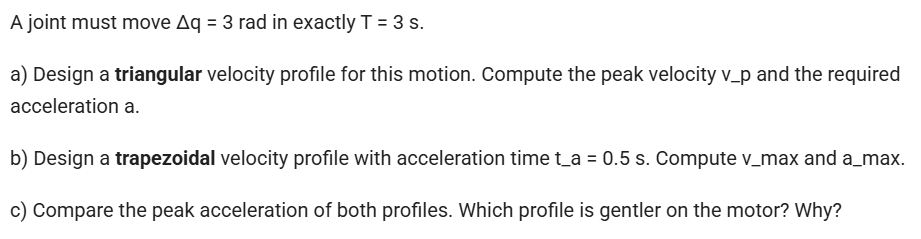

# Trajectory planning
## Exercise 1

Given a position graph, identify: where velocity is zero, where velocity is maximum, and where acceleration is positive or negative.

For this exercise, keep in mind that:

Speed 0 =  where the graph is horizontal

Maximum speed =  where the slope is steepest

Positive acceleration = when the slope increases 
(upward curve)

Negative acceleration = when the slope decreases (downward curve)

### Point analysis:

Zero velocity: A, E, G.

Maximum velocity: D

Positive acceleration: B, C.

negative acceleration: F

## Exercise 2

Given a trapezoidal velocity graph, compute total displacement from the area under the curve.

### Formula:
Δq = ½ (ta)(vmax)+(ta)(vmax) + ½ (ta)(vmax)

### Procedure:

Δq = ½ (0.5)(0.8) + (2)(0.8) + ½  (0.5)(0.8)

Δq = 2 rad

## Exercise 3

### A)

## Exercise 4

Sketch the position graph corresponding to a given velocity graph.

## Exercise 5

## Exercise 6

