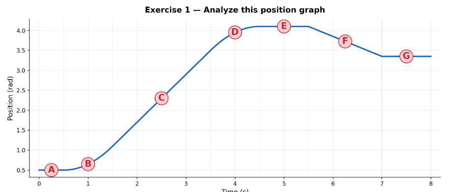
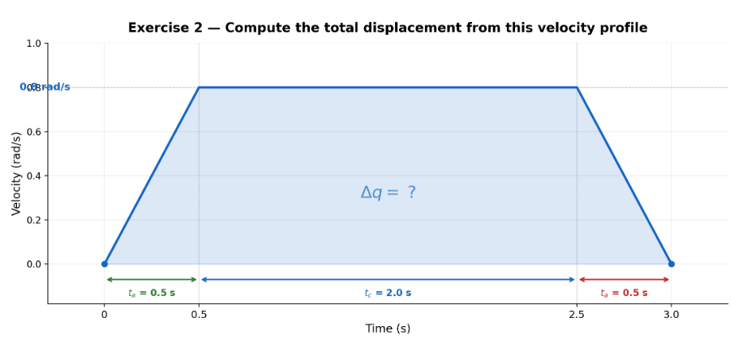
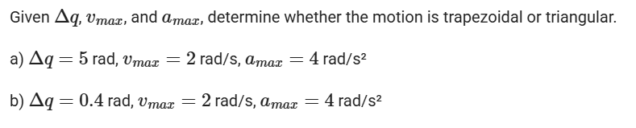
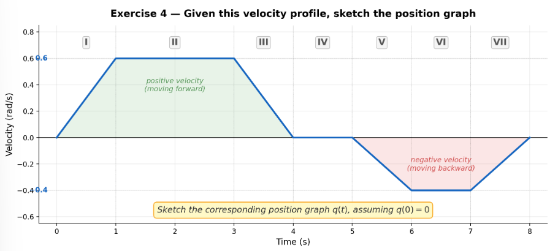
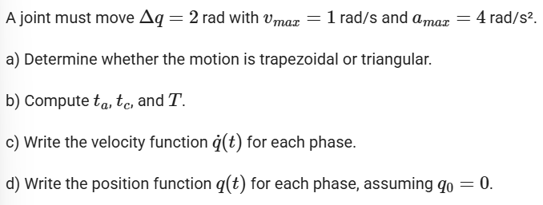

# Trajectory planning
## Exercise 1

Given a position graph, identify: where velocity is zero, where velocity is maximum, and where acceleration is positive or negative.

## Exercise 2

Given a trapezoidal velocity graph, compute total displacement from the area under the curve.

## Exercise 3

## Exercise 4

Sketch the position graph corresponding to a given velocity graph.

## Exercise 5

