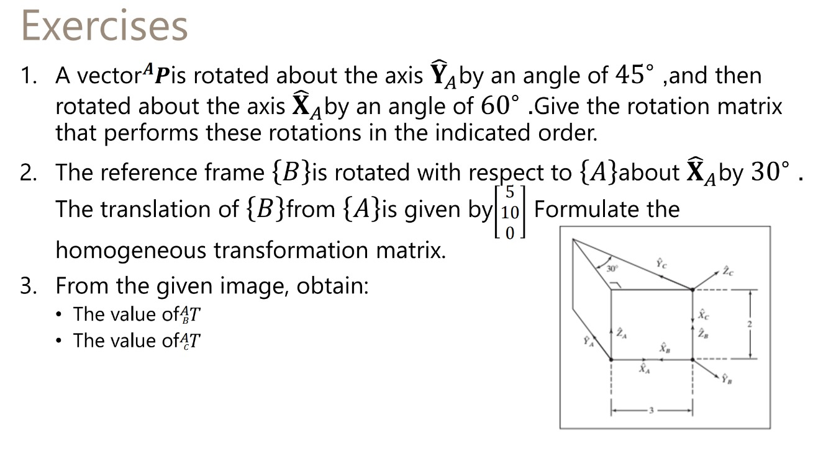

# Transform Nomenclature

## 1. Rotation of vector PA
RyA​​(45∘)=

| cos  | 0 | sin  |
|----: |:-:|------|
|  0   | 1 |   0  |
| -sin | 0 |  cos |

---
RxA​​(60∘)=

| 1 | 0 | 0  |
|----: |:-:|------|
|  0   | cos |   -sin  |
| 0 | sin |  cos |

---

R=

| 0.7071  | 0 | 0.7071  |
|----: |:-:|------|
|  0.6123   | 0.5000 |   -0.6124  |
| -0.3536 | 0.8660 |  0.3536 |

---

## 2. Homogeneous transformation ATB

pAB=

|5|
|:|
|10|
|0|

Rotation matrix

Rxa(30°)=

| 1  | 0 | 0  |
|----: |:-:|------|
| 0  | cos | -sin |
| 0  | sin |  cos |

---

Homogeneous transformation

| 1  | 0 | 0  | 5 |
|----: |:-:|------|----|
| 0  | 0.8660 | -0.500 |  10|
| 0  | 0 |  0 |   1|

## 3. From the given image

(a) aTb Translation:

x=3

z=2

| 1  | 0 | 0  | 3 |
|----: |:-:|------|--|
| 0  | 1 | 0  | 0 |
| 0  | 0 | 1  | 2 |
| 0  | 0 | 0  | 0 |

(b) aTc

x=3

z=2

RxA​​(30∘)= 

| 1  | 0 | 0  | 3 |
|----: |:-:|------|--|
| 0  | 0.8660 | -0.5  | 0 |
| 0  | 0.5 | 0.8660  | 2 |
| 0  | 0 | 0  | 1 |
